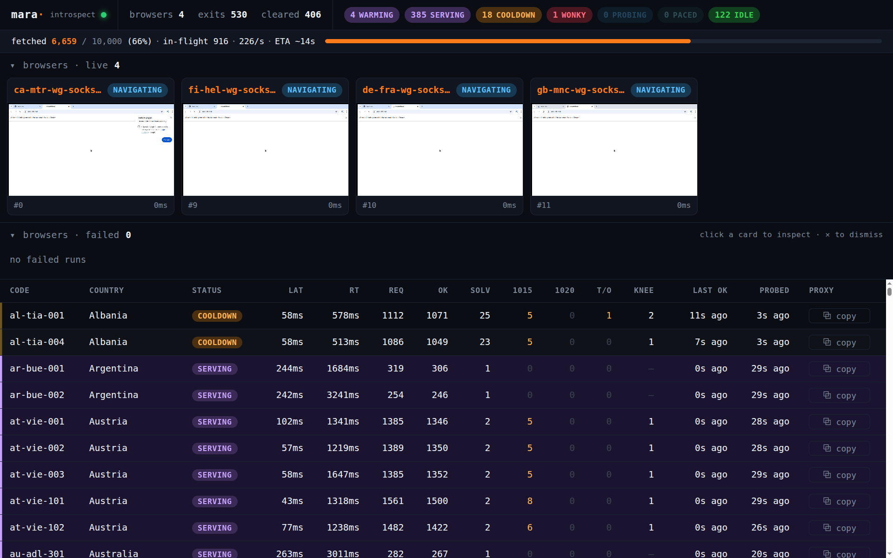

# mara

A high-performance scraper that clears bot-protection challenges, written in Rust.

[](https://github.com/apanloco/mara/actions/workflows/ci.yml)
[](LICENSE)

mara solves a bot-protection challenge **once** in a real browser to bank a
`cf_clearance` cookie, then serves every subsequent request browser-free — a slim
HTTP client replaying the cookie over a rotating pool of egress IPs. The browser is
the fallback; the slim path is the hot path.



## Features

- **Very high performance** - throughput scales with warm exits, not browsers, and memory stays flat whether the batch is ten URLs or a hundred million.
- **Rotates a pool of exits** - a live proxy catalog or your own SOCKS5 endpoints, with per-IP and pool-wide rate pacing.
- **Clears challenges** - solves challenges in a real browser on a virtual framebuffer.
- **Low resource usage** - scrapes with slim clients using cookies from completed challenges.
- **Live dashboard** - a single-page UI over WebSocket for the exit pool, batch progress, and live browser views.

## CLI

```console
$ mara fetch https://example.com/a https://example.com/b   # clear + fetch pages
$ mara fetch --mullvad --serve https://example.com         # rotate the live Mullvad catalog, keep the dashboard up
$ mara capture https://example.com                         # open a headed browser and clear interactively
$ mara doctor                                              # check the environment
```

The `fetch` command registers each target host as Cloudflare-protected by default;
pass `--raw` to fetch a host as-is without the solve path.

## Library usage

```rust
use futures::StreamExt;
use mara::{Client, Config};

#[tokio::main]
async fn main() -> anyhow::Result<()> {
    let client = Client::new(Config::default()).await?;
    let urls = vec!["https://example.com/a".into(), "https://example.com/b".into()];

    // One result per input URL, in completion order.
    let mut results = client.fetch_all(urls);
    while let Some(item) = results.next().await {
        match item.result {
            Ok(page) => println!("{} → {} bytes", item.url, page.value.len()),
            Err(err) => eprintln!("{} failed: {err}", item.url),
        }
    }
    Ok(())
}
```

## License

[MIT](LICENSE).
